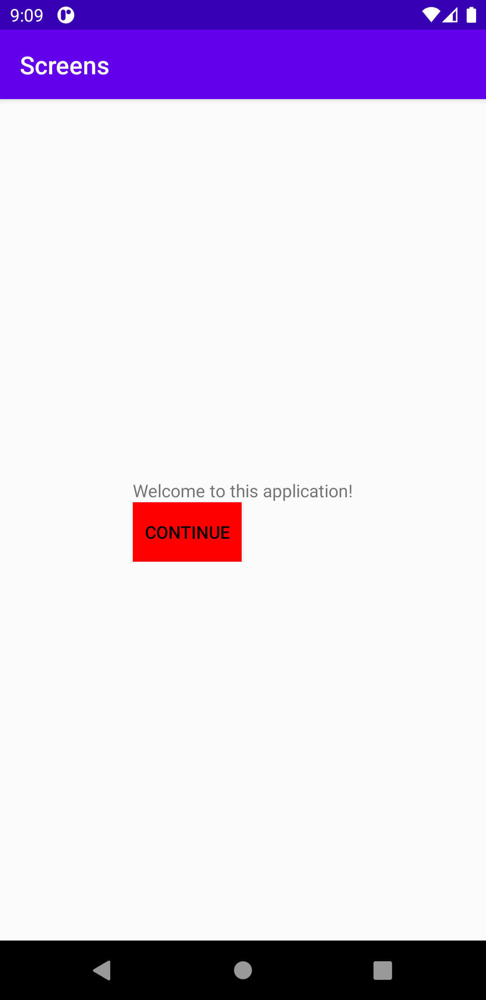
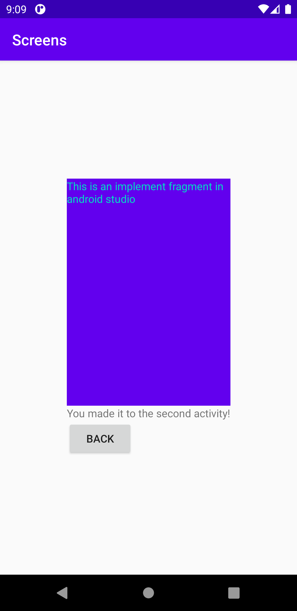

# Rapport

## Assignment 4: Screens

I layout i main activity har vi skapat en textview och en button. I koden nedan ser vi att en button
identifieras med id main_button, vilket är den button som finns i main activity. Sedan gör vi en click
funktion på button där vi skapar ett nytt intent. Detta ger oss möjlighet att byta till en screen med
en annan layout. Vi behöver alltså skapa en activity till som kommer att vara våran second activity.
Main activity ligger då bakom second activity som öppnas istället. I Figur 1 kan vi se hur layouten
ser ut i main activity.

```
Button mainButton = findViewById(R.id.main_button);

mainButton.setOnClickListener(new View.OnClickListener() {
    @Override
    public void onClick(View view) {
        Log.d("CONTINUE_BUTTON", "Continue to second activity");

        Intent intent = new Intent(MainActivity.this, SecondActivity.class);
        startActivity(intent);
    }
});
```


*Figur 1. MainActivity med textview och button*

I second activity har vi också en button i layouten och den deklareras i alltså i second activity.
Vi ger även den button en click funktion där vi säger att om knappen används så körs koden finish();
vilket gör att second activity stängs och användaren återvänder till main activity igen.

```
Button secondButton = findViewById(R.id.second_button);

secondButton.setOnClickListener(new View.OnClickListener() {
    @Override
    public void onClick(View view) {
        Log.d("BACK_BUTTON", "Back to main activity");

        finish();
    }
});
```

Om vi har en del av layouten som vi inte vet på vilken sida vi vill lägga information eller det till och
med är så att samma information förekommer flera gånger i samma app så kan det vara lämpligt att skapa
ett fragment för det. Genom att skapa ett fragment och ge den en egen layout-fil så går det att skapa
utseendet för fragmentet för att sedan bestämma var det ska implementeras. Som vi ser i del 1 av koden
nedan så har vi implementerat ett fragment i second activity som säger att den ska hämta BlankFragment.
I BlankFragment har vi sagt att vi ska returnera layouten som finns i fragmentets layout som vi kan se i
del 2 av koden. På så vis har vi hämtat en layouten för en del av second activity men det går även att
ge fragmentet layouten för en hel sida. Fördelen är ju då att det går att hämta layouten för det fragmentet
flera gånger i samma app istället för att behöva upprepa samma kod flera gånger. Utseendet för second
activity kan vi se i Figur 2.

*Kod del 1, i layouten för second activity*
```
<fragment
    android:name="com.example.screens.BlankFragment"
    android:layout_width="match_parent"
    android:layout_height="300dp"
    android:tag="blank_fragment"/>
```

*Kod del 2, i BlankFragment*
```
@Override
public View onCreateView(LayoutInflater inflater, ViewGroup container,
                         Bundle savedInstanceState) {
    // Inflate the layout for this fragment
    return inflater.inflate(R.layout.fragment_blank, container, false);
}
```


*Figur 2. SecondActivity med fragment, textview och button*